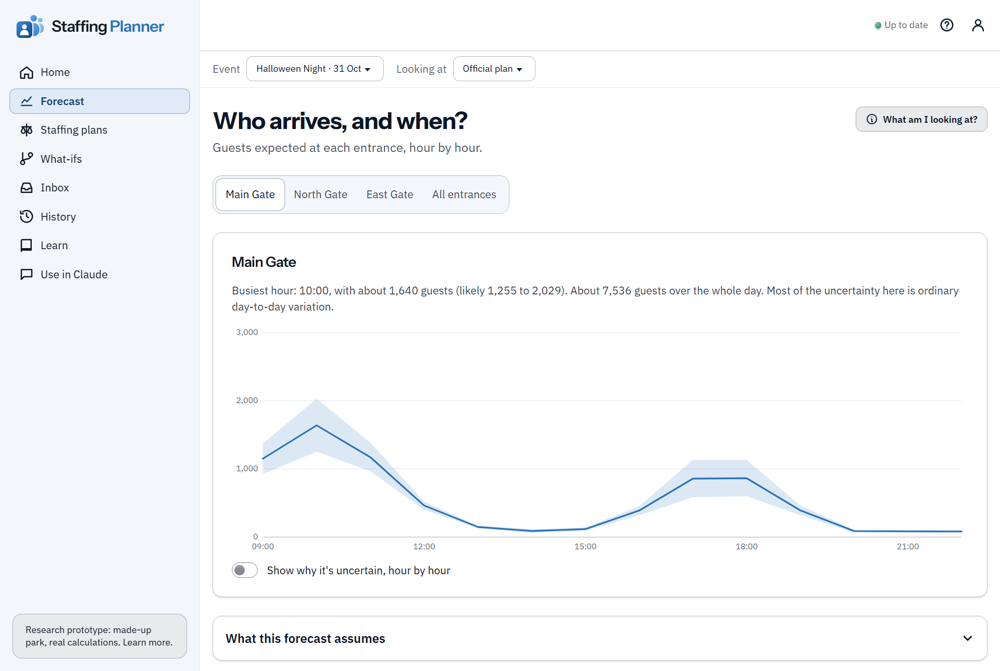
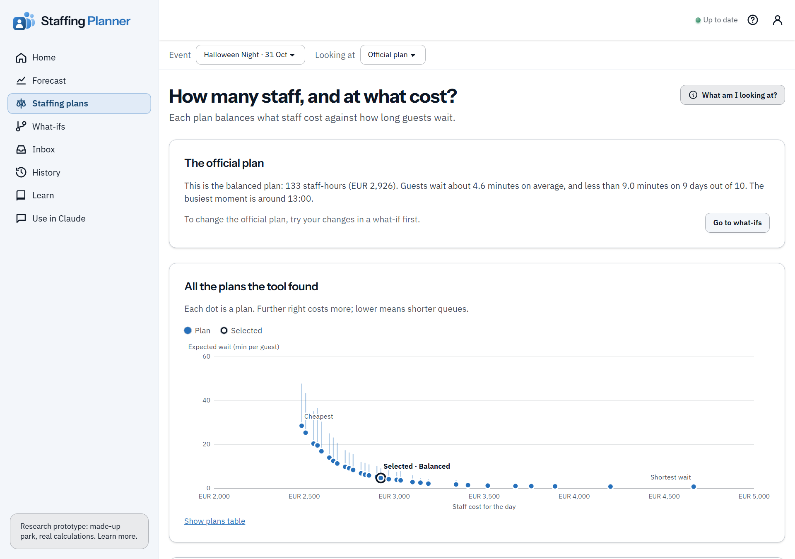
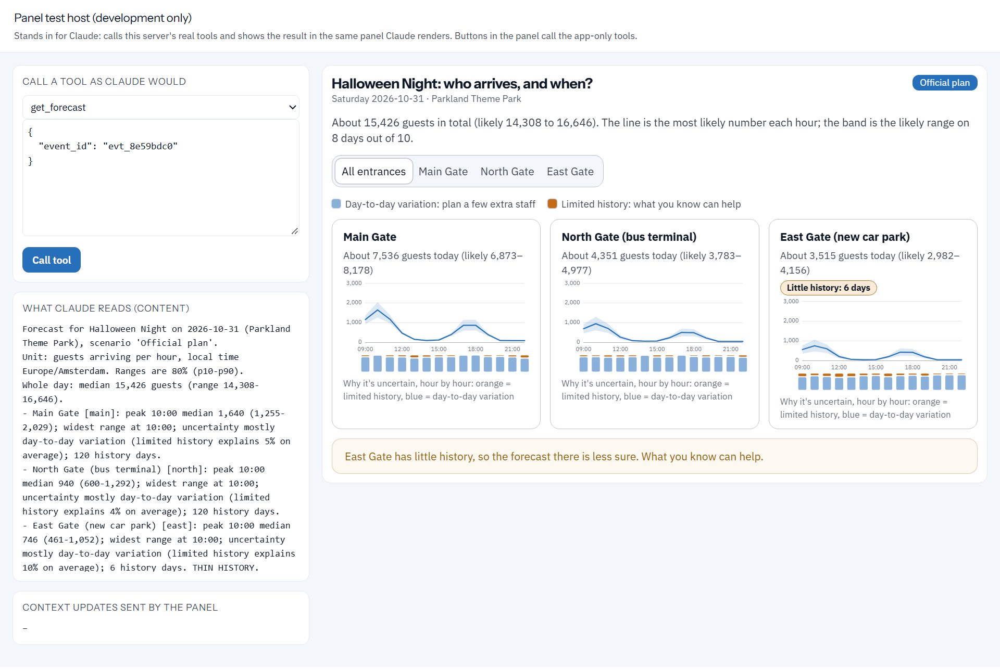

<div align="center">

<h1>
  <picture>
    <source media="(prefers-color-scheme: dark)" srcset="docs/brand/lockup-dark.png">
    
  </picture>
</h1>

**Forecasts how many guests arrive at each entrance and suggests staffing plans, in Claude and on the web.**

A research prototype for event planners. The forecast shows how sure it is and why, a planner's notes become rules the staffing optimizer follows, and nothing changes until the planner confirms it.

[](pyproject.toml)
[](LICENSE)
[](pyproject.toml)
[](#use-it-in-claude)

[How it works](#how-it-works) · [Use it in Claude](#use-it-in-claude) · [Run it locally](#run-it-locally) · [Deploy](#deploy) · [Code map](#code-map) · [Live site](https://forecast-mcp.ashyground-d96d5f06.malaysiawest.azurecontainerapps.io/)

</div>

---

<p align="center">
  
</p>

## Why this exists

Every event asks the same question: how many people should work at each entrance, and when? Too few and guests queue; too many and money is wasted. The hard input is the number of guests, which nobody knows exactly.

This prototype tests two ideas:

1. Showing planners why a forecast is unsure helps them act on it. The tool splits its uncertainty into ordinary day-to-day variation, which calls for a few extra staff, and limited history, which the planner's own knowledge can reduce.
2. A planner's note in plain words ("roadworks close the north road from 5 to 8 pm") can become a formal rule for the staffing optimizer, as long as the planner checks how it was understood before anything changes.

## What is real and what is made up

| | |
| --- | --- |
| The park | Made up. Parkland Theme Park, its three entrances and 120 days of visitor history are synthetic, built to behave like real arrivals: busy mornings, an evening rush before the show, quieter rainy days and one entrance with only 6 days of history. |
| The numbers | Calculated. Every forecast and staffing plan is computed from that history by the forecasting model and the optimizer; none of it is typed in. |
| The forecast check | On past days the model had not seen, its 80% ranges are compared with what happened. The coverage appears on the welcome page and in the forecast notes. |
| The methods | Deliberately simple stand-ins behind stable interfaces, so stronger models can replace them. |

## How it works

One server has two front doors that share one database:

- The website (`/`): planners read the forecast, try what-ifs, compare staffing plans and make one official.
- The MCP endpoint (`/mcp`): Claude shows the same charts inside the chat through an [MCP Apps](https://modelcontextprotocol.io) panel, writes down planners' notes as constraints, and explains the results.

A change made through either door shows up in the other within a couple of seconds.

### The forecast

The forecast is a bootstrapped ensemble of gradient-boosted quantile models. Each entrance and hour gets a most likely value and an 80% range. By the law of total variance, the spread splits into the average variance inside each ensemble member (day-to-day variation) and the variance between members (limited history).

### The staffing plans

The plans come from NSGA-II (pymoo), a multi-objective evolutionary algorithm. It chooses how many lanes to staff at each entrance and hour, trading staff cost against guest waiting. Waits are estimated with a fluid backlog and Sakasegawa's M/M/c approximation, and every plan is also checked on sampled bad days. The result is a set of plans from cheapest to shortest queues, and the planner picks one.

### A planner's note

A note takes five steps:

1. The planner tells Claude, for example, "roadworks close the north road from 5 to 8 pm".
2. Claude calls `propose_constraint` with the planner's exact words, a structured constraint (`gate_closed`, north, 17:00 to 20:00) and anything it had to guess. The constraint is pending.
3. The chat panel shows Claude's reading with Confirm and Reject buttons. These call tools that the host hides from Claude, so only the planner can confirm.
4. A confirmed constraint goes into a what-if scenario, and the forecast and optimizer rerun on their own.
5. The planner picks a plan and makes the what-if official. Only then does the official plan change. The history records who did what, when, through which door and from which note.

<p align="center">
  
  
</p>

## Use it in Claude

The live server runs at `https://forecast-mcp.ashyground-d96d5f06.malaysiawest.azurecontainerapps.io`.

1. In Claude, open Settings, then Connectors, and add a custom connector with the address `https://forecast-mcp.ashyground-d96d5f06.malaysiawest.azurecontainerapps.io/mcp`. Custom connectors need a paid Claude plan.
2. Sign in when Claude asks. You get a private copy of the demo park.
3. Ask in your own words, for example "Show me the forecast for Halloween Night" or "Roadworks close the north road from 5 to 8 pm".

Tools Claude can call:

| Tool | What it does |
| --- | --- |
| `list_events` | Events with their entrances, opening hours and scenarios |
| `get_forecast` | Arrivals per entrance and hour, with the 80% range and why it is unsure |
| `propose_constraint` | Records a planner's note as a pending constraint for them to confirm |
| `create_what_if` | Starts a what-if as a copy of the official plan |
| `get_scenario_result` | The cost versus waiting trade-off, the chosen plan and the comparison with the official plan |

The panel's buttons use five more tools (`confirm_constraint`, `reject_constraint`, `select_plan`, `promote_scenario`, `get_scenario_state`) that the host hides from Claude.

## Run it locally

You need [uv](https://docs.astral.sh/uv/).

```bash
uv sync
```

```bash
uv run forecast-mcp
```

Then open http://127.0.0.1:8000/. On first start the server creates the tables, generates the demo park and trains the forecast model, which takes about 10 seconds. Without sign-in settings it runs as a single local user.

To try the chat panel without Claude, open http://127.0.0.1:8000/dev/panel. That page stands in for Claude: it calls the real tools and renders the panel Claude would show.

The Python package and the command are still called `forecast-mcp`, the project's working name.

### Database

Without `DATABASE_URL` the server uses a local SQLite file (`local.db`). To use Postgres (the live site uses [Neon](https://neon.tech)), copy `.env.example` to `.env` and set `DATABASE_URL`. `.env` is git-ignored.

The schema is managed by Alembic migrations in `src/forecast_mcp/migrations`, applied at start-up. After changing a table in `db.py`, generate a migration:

```bash
uv run alembic revision --autogenerate -m "describe the change"
```

A test fails if `db.py` and the migrations disagree.

## Sign-in

With `AUTH_MODE=oidc`, people sign in through an OpenID Connect provider, and each new user gets a private workspace with a fresh copy of the demo. The live site uses WorkOS AuthKit.

- Claude (`/mcp`): unauthenticated requests get `401` and a pointer to `/.well-known/oauth-protected-resource/mcp`, which names the provider. Claude registers itself with the provider, signs the user in and sends an access token. The server checks its signature, issuer, expiry and audience.
- Website: a sign-in button using the authorization-code flow. The result is a signed session cookie.

The provider must support Dynamic Client Registration or Client ID Metadata Documents, S256 PKCE and JWT access tokens with a JWKS. Register the redirect URIs `https://claude.ai/api/mcp/auth_callback` (Claude) and `<PUBLIC_BASE_URL>/auth/callback` (website).

Settings: `AUTH_MODE=oidc`, `OIDC_ISSUER`, `OIDC_CLIENT_ID`, `OIDC_CLIENT_SECRET`, `MCP_AUDIENCE` (usually `<PUBLIC_BASE_URL>/mcp`) and `SESSION_SECRET`. See `.env.example`. If the website login rejects PKCE, set `OIDC_PKCE=0`.

With `AUTH_MODE=none`, anyone with the address can read and change the data. Use that only for a short test.

## Deploy

The server is one always-on process: web server, MCP endpoint and a background worker for forecast and optimization runs. The `Dockerfile` builds it for any container host. Set the variables from `.env.example` with `ENV=production`.

### Azure Container Apps

The live site runs on Azure Container Apps with an Azure for Students subscription. `deploy/azure.ps1` creates a resource group, a Basic container registry and a Container Apps environment and app. The app scales to zero when idle. Secrets go from `.env` into Azure and GitHub secrets.

Student subscriptions cannot build images in Azure, so GitHub Actions runs the tests, builds the image, smoke-tests it and uploads it to the registry.

1. Log in to Azure:

   ```bash
   az login
   ```

2. Run this once. It creates the registry, stores its credentials as GitHub secrets and starts a build:

   ```bash
   powershell -ExecutionPolicy Bypass -File .\deploy\azure.ps1 -ConnectGitHub
   ```

3. When the GitHub workflow has passed, deploy the image of the latest pushed commit. Repeat after each push:

   ```bash
   powershell -ExecutionPolicy Bypass -File .\deploy\azure.ps1
   ```

Sign-in stays on once the `OIDC_*` values are in `.env`. Add `-PruneImages` now and then to keep only the 5 newest images.

`render.yaml` describes the same service for Render. It was written but not used, because Render Blueprints ask for a payment card.

### Running it for free

- Database: Neon's free plan. The idle worker checks the database only every 10 minutes so Neon can pause, old runs are deleted (two kept per scenario), the website stops polling while its tab is hidden, and each user's demo copy takes about 1 MB.
- Sign-in: WorkOS AuthKit's free tier, in the staging environment.
- Host: about 250 MB of memory. On hosts with a fraction of a CPU, set `ENGINE_PROFILE=light` and expect slower runs.

Several instances can share one database: runs are claimed with `FOR UPDATE SKIP LOCKED`, and migrations take a lock. At start-up the server warns about unsafe production settings, and with `AUTH_MODE=oidc` and missing settings it refuses to start.

## Website styles

The pages use [daisyUI 5](https://daisyui.com) on Tailwind CSS 4, with a white and blue theme shared with [AdviceIT](https://github.com/Raditya-P/AdviceIT) and a dark theme for the chat panel. Text is set in IBM Plex Sans and headings in Instrument Sans, both under the SIL Open Font License and served from the site. Every text colour was checked for at least 4.5:1 contrast, and the two chart colours were checked for colour-blind separation.

The stylesheet is built into `src/forecast_mcp/static/app.css`, which is committed and also inlined into the chat panel. After changing classes in the HTML or JS files, rebuild it with Tailwind's standalone program saved at `tools/tailwindcss.exe` (no Node.js needed):

```bash
powershell -ExecutionPolicy Bypass -File .\scripts\build-css.ps1
```

## Code map

| Path | What it does |
| --- | --- |
| `src/forecast_mcp/constraints.py` | The shared constraint definition and its validation |
| `src/forecast_mcp/engines/synthetic.py` | Synthetic history with controlled volatility and a thin-history entrance |
| `src/forecast_mcp/engines/forecast.py` | Bootstrapped ensemble of quantile models and its out-of-bag backtest |
| `src/forecast_mcp/engines/contract.py` | The forecast contract (p10/p50/p90, uncertainty split, totals, notes) and the text summary Claude reads |
| `src/forecast_mcp/engines/optimizer.py` | NSGA-II staffing, the queue model and the bad-day check |
| `src/forecast_mcp/services.py` | Rules both doors share: pending, confirm, undo, promote, history, limits |
| `src/forecast_mcp/jobs.py` | The run queue and its worker: forecast, then optimize |
| `src/forecast_mcp/auth.py`, `accounts.py` | Sign-in and one workspace per user |
| `src/forecast_mcp/middleware.py` | Rate limits and security headers |
| `src/forecast_mcp/mcp_server.py` | MCP tools, the server icon and the `ui://` panel resource |
| `src/forecast_mcp/web.py` | The website's JSON API and pages, and mounting of `/mcp` |
| `src/forecast_mcp/static/` | Website, chat panel, shared chart code, fonts and logo |

## Tests

```bash
uv run pytest
```

The tests cover the engines, constraint validation, the confirm and promote rules, workspace isolation, sign-in (with a locally generated signing key), migrations matching the models, rate limits and headers, the MCP protocol (in-process and over HTTP) and the website's API.

## Known limitations

- The ensemble understates uncertainty where data is scarce. East Gate has only 6 days of history, yet most of its range is attributed to day-to-day variation. The thin-history badge is therefore a separate, explicit signal.
- Waiting times come from a per-hour approximation. They are good enough to compare plans, not to predict exact queue lengths.
- Every workspace holds the demo park. There is no import for a venue's own data yet.
- Views learn about changes by polling every 2 seconds, and runs execute one at a time.

## Citation

If you use this software, please cite it with the details in [CITATION.cff](CITATION.cff).

## License

The code is under the [MIT License](LICENSE). The fonts in `src/forecast_mcp/static/fonts` are under the SIL Open Font License; their license files sit next to them.
